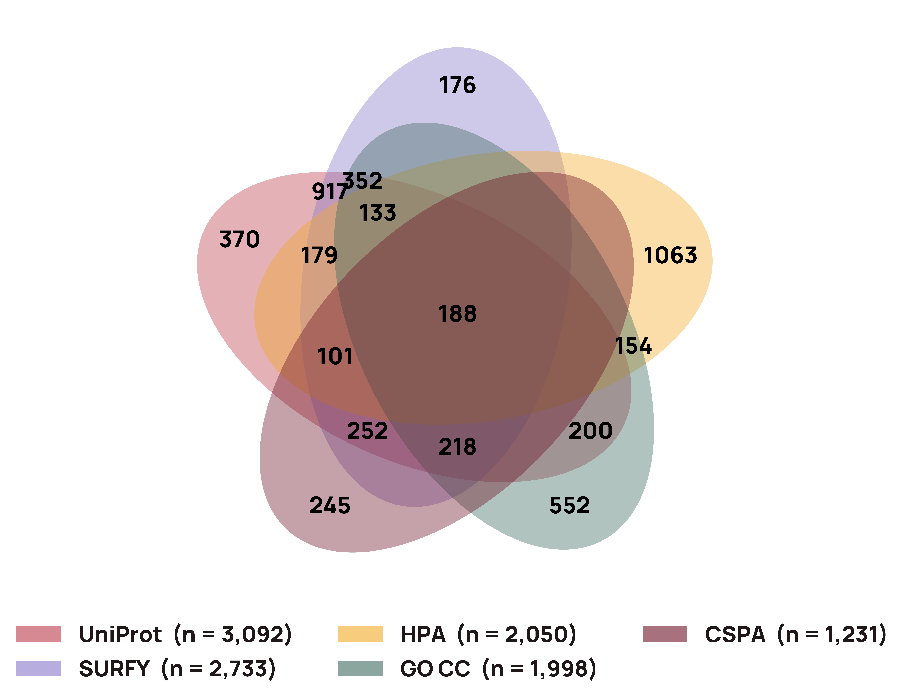

# The accessible human surfaceome

An evidence-graded, per-claim-cited annotation of the **human cell-surface
proteome** — surfaced as a database, a public JSON API, an interactive
viewer, and (in v0) a blog with a stable DOI/SWHID-citable snapshot.

The headline call per protein is *accessibility* — physical surface
localization, extracellular-face exposure, and any conditional/induced
surface presentation (cell-state induced, tissue subset, trafficking
cycling). The catalogue is built **agnostic to therapeutic modality**
so the same per-gene record informs ADC, CAR-T, mRNA-LNP, LYTAC, and
delivery-target selection alike.

MIT-licensed; copyright Michael Smallegan and Rebecca Carlson. Full
design notes:
[docs/plans/2026-04-16-surface-proteome-annotation.md](docs/plans/2026-04-16-surface-proteome-annotation.md).

## Why this exists

Existing surface-proteome databases (SURFY, CSPA, UniProt subcellular,
GO cellular-component, HPA) disagree heavily on what counts as a
surface protein. The 5-way overlap is much smaller than the union, and
the disagreement is not noise — it encodes real evidence asymmetries
that no current DB exposes to the reader.



The concrete failure modes:

- **False positives** — `ABCB9` (lysosomal) carries a SURFY surface call;
  `KRAS` is membrane-anchored on the *inner* leaflet but appears in
  multiple "surface" panels because they conflate topology with
  accessibility.
- **False negatives** — proteins with strong primary-literature surface
  evidence but no DB vote.
- **No graded evidence** — every existing source gives a binary call;
  none distinguishes "constitutive strong surface" from "cell-state
  induced trafficking" from "predicted topology, never assayed."
- **No per-claim citations** — none of the DBs let you ask *why* a
  protein is listed as surface, with the verbatim quote and source.

The deliverable is a single per-gene record that fixes all four:
graded surface-accessibility, separate topology, per-claim primary
citations, and structured contradiction adjudication where sources
disagree.

## What we deliver, per protein

Two orthogonal fields plus an evidence pack:

- **`surface_status`** — "is this protein accessible from the
  extracellular side of an intact plasma membrane?" Graded:
  `strong_surface` / `moderate_surface` / `weak_surface` /
  `rare_surface` / `absent` / `contradictory`.
- **`topology`** — "how is this protein associated with the plasma
  membrane?" Enum: `transmembrane_single_pass` /
  `transmembrane_multi_pass` / `outer_leaflet_peripheral` /
  `gpi_anchored` / `inner_leaflet_peripheral` /
  `cytosolic_pm_adjacent` / `not_pm_associated`.

These are orthogonal: `KRAS` has `topology=inner_leaflet_peripheral`
*and* `surface_status=absent`. The two fields must both be reported;
interpreting `topology` alone reproduces the SURFY failure mode.

Each per-gene `SurfaceomeRecord` carries:

- per-claim **Evidence chain** anchored to verbatim quotes + content
  hashes from cached sources;
- `surface_biology` (incl. membrane microdomains), `isoform_accessibility`,
  `coreceptor_requirements`, `orthology`, `paralogs`,
  `surface_engagement_validation`;
- **structured contradiction adjudication** between DB and primary
  literature, with the reasoning surfaced rather than collapsed;
- a **DB-comparison row** (SURFY / CSPA / UniProt / GO / HPA labels
  alongside ours) for disagreement analysis.

## Major phases

The project is split into clean phases that ship independently. Each
phase has its own outputs, its own audit gates, and its own commands.

```
M0 pre-work  ──▶  M1 candidate universe  ──▶  Surface triage  ──▶  Deep dive  ──▶  Publication
(done)            (done)                      (done + benchmarked)  (in progress)   (planned)
```

### M0 — Pre-work (complete)

Alias disambiguation, model pricing verification, Batch API
eligibility, licensing review across all sources (UniProt CC-BY,
HGNC CC-BY, GO CC-BY, HPA CC-BY-SA, Unpaywall per-paper, no Serper
redistribution). The output is `LICENSING.md` + a vetted list of which
cached artifacts ship publicly vs which stay local.

### M1 — Candidate universe (complete)

Recall-first union of seven sources (SURFY, CSPA, UniProt, GO, HPA,
DeepTMHMM, COMPARTMENTS) into a per-protein vote panel. The merged
universe is the input to triage; every protein with **any one** credible
DB or ML vote enters, even when sources disagree. Disagreement is the
signal the downstream pipeline is designed to consume, not noise to
filter out.

Code: `src/accessible_surfaceome/sources/` + `merge/`. Outputs:
`data/processed/candidate_universe/candidate_universe.tsv`.

### Surface triage (complete + benchmarked)

A lightweight per-protein verdict (`yes` / `contextual` / `no`) with
confidence and `key_uncertainty`. Pure-model inference, no tools —
designed to run cheaply across the full M1 universe so the expensive
deep-dive only fires on candidates that survive triage.

The triage agent is benchmarked against a curated **truth set**
(`data/analysis/triage_bench/`) with labels assembled by hand from
primary literature; runs across multiple model variants live in D1
(`surfaceome_agents.triage_benchmark`). The benchmark gate is what
licenses the deep-dive sweep — without it, a stale or regressed triage
prompt could quietly mis-route the expensive step.

Code: `src/accessible_surfaceome/agents/surface_triage/`. Runner:
`scripts/triage_runner.py`.

### Deep dive (in progress)

Per-protein `SurfaceomeRecord` v0.5.0 — the full annotation described
in [What we deliver](#what-we-deliver-per-protein). Runs Sonnet 4.6
(~$0.30–0.50 per gene, ~5 min wall-clock), with structured tool calls
against cached corpora (PubMed, UniProt, HPA, OpenAlex, structure DBs).

Current status: **proof-of-concept working** for individual genes.
Reference records published:
- [GPR75](https://api.deliverome.org/surfaceome/v1/genes/GPR75) — first
  public deep dive, included in the v0 deposit;
- [HSPA1A](docs/evals/hspa1a-deep-dive-eval-2026-05.md) — conditional-
  surface stress test (heat-shock-induced surface presentation);
- TGOLN2 — trafficking_cycling test (constitutive surface ↔ TGN
  recycling).

The bulk-run posture (running deep-dive across the full triage-positive
set) is not yet executed — pending audit-gate sign-off on the corpus
round-trip + Sonnet entailment validators. See `docs/evals/` for the
gate criteria and current measurements.

Code: `src/accessible_surfaceome/agents/surface_annotator/`. Runner:
`uv run accessible-surfaceome agents annotate <SYMBOL>`.

### Publication (planned)

A blog post + open code + DOI/SWHID-citable snapshot once the deep-dive
audit gates pass and the headline disagreement spotlight (n=100 DB-vs-
ours adjudication) is curated. Per the Lambert et al. analogue, the
**resource is the site, not the table** — the per-gene viewer (see
below) is the citable artifact.

Citation infrastructure splits across four parallel channels, each
optimized for a different reader/bot:

| Channel | Citable as | What's in it |
|---|---|---|
| **Software Heritage** | `swh:1:rev:<sha>` per gist | Each figure's bundled data + script + README (content-addressed, append-only, free; see `data/analysis/figures/swhid_map.json`) |
| **Zenodo — code series** (auto via GitHub-Zenodo integration) | One DOI per GitHub Release | The repo tarball at the tagged commit |
| **Zenodo — data series** (manual via `scripts/release/publish-archive.py`) | `10.5281/zenodo.20805384` (reserved) | Triage runs with reasoning, benchmark runs with reasoning, deep-dive bundle |
| **Zenodo — manuscript record** (manual via Zenodo UI, registered under bioRxiv DOI as external) | bioRxiv DOI | Manuscript PDF + JATS XML; **Unpaywall OAI-PMH harvest picks it up and adds the Zenodo PDF as a bot-accessible `oa_location` under the bioRxiv DOI** — the bot-reach motivation for the dual-deposit pattern |

The release ritual is one command for the data record — see
[scripts/release/README.md](scripts/release/README.md). The manuscript
record is a one-time manual UI step (also documented in
`scripts/release/README.md` under "Manuscript deposit").

## Architecture

```
                     ┌──────────────────────────┐
                     │   M1 candidate universe   │
                     │  (SURFY+CSPA+UniProt+GO+  │
                     │   HPA+DeepTMHMM+COMPART.) │
                     └─────────────┬────────────┘
                                   │ candidate_universe.tsv
                                   ▼
        ┌────────────────────────────────────────────┐
        │           Surface triage agent              │
        │   (Sonnet 4.6, pure inference, no tools)    │
        │   yes / contextual / no  +  confidence      │
        └─────────────┬─────────────────┬────────────┘
                      │                 │
                      ▼                 ▼
        ┌──────────────────┐   ┌─────────────────────┐
        │ triage benchmark │   │   Deep dive agent    │
        │ (truth labels in │   │  (Sonnet 4.6 + tools │
        │  D1, audited)    │   │   → SurfaceomeRecord)│
        └──────────────────┘   └──────────┬──────────┘
                                          │
                                          ▼
                              ┌───────────────────────┐
                              │  D1: surfaceome_agents │ ← private (cost/tokens)
                              │      (full run logs)   │
                              └───────────┬───────────┘
                                          │ sync_public_d1.py (one-way)
                                          ▼
                              ┌───────────────────────┐
                              │  D1: surfaceome_public │ ← public mirror
                              │  (column-whitelisted)  │
                              └───────────┬───────────┘
                                          │ Cloudflare Worker
                                          ▼
                              ┌───────────────────────┐
                              │   /v1 JSON API + the   │
                              │   surfaceome viewer    │
                              └───────────────────────┘
```

## Cloud / public data

Two Cloudflare D1 databases on the same account:

- **`surfaceome_agents`** (private) — full agent runs, prompt history,
  token / cost telemetry, raw model output. The pipeline reads + writes
  this via the HTTP API; see `cloudflare/d1_schema.sql` +
  `cloudflare/d1_compara_schema.sql`.
- **`surfaceome_public`** (public mirror) — column-whitelisted subset of
  the private DB: Ensembl Compara orthologs, benchmark truth labels,
  triage verdicts (sans cost/token data), and per-gene
  `SurfaceomeRecord` JSONs. Schema in `cloudflare/d1_public_schema.sql`.
  Synced one-way from private via `scripts/sync_public_d1.py`.

A read-only **Cloudflare Worker** at
`cloudflare/workers/surfaceome_api/` exposes `surfaceome_public` as a
JSON API:

```
GET /v1/health
GET /v1/genes                    — list of annotated genes
GET /v1/genes/:symbol            — full SurfaceomeRecord
GET /v1/orthologs/:symbol        — mouse + cyno orthologs
GET /v1/benchmark[/{symbol}]     — curated truth labels
GET /v1/triage/:symbol           — per-call model verdicts
GET /v1/catalog                  — full SurfaceomeRecord catalog
```

Deployed at `https://api.deliverome.org/surfaceome/v1/…` (the
`surfaceome/` prefix is stripped by the Worker before route matching,
so `/v1/...` is the contract).

Deploy: `cd cloudflare/workers/surfaceome_api && npx wrangler deploy`.

## Viewer

The `viewer/` directory is a Next.js 16 app (static export) that
renders `SurfaceomeRecord` JSONs. Today it reads static files from
`viewer/public/data/genes/*.json` (committed snapshots — currently
HSPA1A and TGOLN2 as v0.5.0 reference records). The eventual path is
for the viewer to read from the public Worker API instead.

Deployed at `surfaceome.deliverome.org` via a Cloudflare Pages project
pointed at this repo's `viewer/` directory.

## Figure reproducibility

Every "final" figure in `data/analysis/figures/` is paired with a
**reproduction gist** — a standalone script that declares its
dependencies inline via [PyPA inline script metadata](https://packaging.python.org/en/latest/specifications/inline-script-metadata/),
fetches its own input from a content-pinned URL, and re-renders the
figure. The gist URL + a
`provenance` JSON conforming to the
[schema v1](docs/figure-reproducibility-schema.md) is embedded
directly in the figure's PDF / PNG metadata, so a reader who downloads
a figure can recover everything needed to verify or re-run it.

The schema covers six checks across parallel code / data axes
(mutable URL / stable identifier / durable archive). It's
field-agnostic — the same shape works for any computational figure
with cited inputs. See
[`docs/figure-reproducibility-schema.md`](docs/figure-reproducibility-schema.md)
for the spec and
[`scripts/embed_figure_gist_metadata.py`](scripts/embed_figure_gist_metadata.py)
for the embedder.

## Layout

| Path | What lives here |
|---|---|
| `src/accessible_surfaceome/sources/` | One module per M1 data source (`uniprot.py`, `go.py`, `surfy.py`, `cspa.py`, `deeptmhmm.py`, `hpa.py`, `compartments.py`, `ensembl_compara.py`); each exposes `download` / `build` subcommands. Shared helpers under `sources/_support/`. |
| `src/accessible_surfaceome/merge/` | Candidate-universe orchestration; loaders, normalization, gene-symbol resolution. |
| `src/accessible_surfaceome/agents/surface_triage/` | The triage agent (orchestrator + prompts + Pydantic models). |
| `src/accessible_surfaceome/agents/surface_annotator/` | The deep-dive agent (orchestrator + tool registry + deep-dive pack loader + evidence-promotion pipeline + audit module). |
| `src/accessible_surfaceome/audit/` | Audit scripts and figure helpers. |
| `src/accessible_surfaceome/controls.py` | Control-panel builder. |
| `src/accessible_surfaceome/cloud/` | D1 HTTP client + triage-run uploader. |
| `src/accessible_surfaceome/tools/` | Shared per-tool helpers + Pydantic models. |
| `cloudflare/` | D1 schemas + Worker code for the public API. |
| `scripts/` | One-shot data refreshers (`refresh_compara.sh`, `upload_compara_to_d1.py`, `sync_public_d1.py`), the triage runner (`triage_runner.py`), per-eval render scripts, and the release ritual (`scripts/release/`). |
| `viewer/` | Next.js 16 app, deployed at `surfaceome.deliverome.org`. |
| `data/raw/`, `data/external/`, `data/processed/`, `data/annotations/`, `data/analysis/` | Source snapshots, normalized tables, agent outputs, and final figures. Annotations dir is gitignored; `viewer/public/data/genes/` holds the published snapshot. |
| `docs/` | Project plans, eval reports, decisions. |
| `tests/` | Pytest suite. |

## Commands

From the repo root:

```bash
uv sync
uv run accessible-surfaceome build
uv run python -m accessible_surfaceome.merge
uv run python -m accessible_surfaceome.sources.surfy build
uv run python -m accessible_surfaceome.sources.cspa build
uv run python -m accessible_surfaceome.sources.deeptmhmm build
uv run python -m accessible_surfaceome.controls build \
  --controls-json /path/to/canonical_delivery_positive_controls/controls.json \
  --surfaceome-csv /path/to/surfaceome_expressed.csv \
  --mygene-symbol-universe-tsv /path/to/candidate_universe.tsv
```

The candidate-universe merge writes TSV outputs under
`data/processed/candidate_universe/`. The control builder writes a
consolidated panel under
`data/processed/controls/surfaceome_control_panel.tsv` (ADC + Lycia/LYTAC
positives, patent delivery-handle positives, negative controls).

## Agent commands

```bash
# Sync the deep-dive agent to Anthropic (one-time per code change to agent.py / prompts)
uv run accessible-surfaceome agents sync

# Annotate one gene end-to-end (Sonnet 4.6, ~$0.30-0.50, ~5 min):
uv run accessible-surfaceome agents annotate HSPA1A

# Audit the corpus round-trip + Sonnet entailment on a record:
uv run accessible-surfaceome agents audit-corpus HSPA1A

# Run the triage benchmark sweep (147-gene mainbench):
uv run python scripts/triage_runner.py --model claude-sonnet-4-6 --replicates 1 --d1
```

## D1 / public-mirror commands

```bash
# Refresh Ensembl Compara CSV + upload to D1:
bash scripts/refresh_compara.sh

# One-way push from private surfaceome_agents → public surfaceome_public:
uv run python scripts/sync_public_d1.py

# Deploy the public API Worker:
cd cloudflare/workers/surfaceome_api && npx wrangler deploy
```

## Release commands

The release ritual mints a Software Heritage SWHID for the repo + every
figure-reproduction gist, audits embedded figure metadata, and drafts a
Zenodo deposit for the heavy data outputs (triage benchmark with
reasoning, per-gene deep-dive JSONs). See
[`scripts/release/README.md`](scripts/release/README.md) for the full
ritual.

```bash
# Dry run — show what would happen, no API calls:
./scripts/release/publish-archive.py --dry-run

# Software Heritage only (no Zenodo activity):
./scripts/release/publish-archive.py --skip-zenodo

# The real thing — heavy data record (code record via GitHub auto-archive):
ZENODO_TOKEN='...' ./scripts/release/publish-archive.py
```

## Quality checks

```bash
bash scripts/check-py.sh             # ruff + ty + pytest
uv run ty check                       # type-check only
uv run pytest -q                      # tests only
uv run pre-commit run --all-files --config .pre-commit-config.yaml
```

## Documentation

- [Project scoping plan](docs/plans/2026-04-16-surface-proteome-annotation.md) — full design notes, Lambert et al. analogue, audit-gate criteria, cost model.
- [Figure reproducibility schema (v1)](docs/figure-reproducibility-schema.md) — what we embed in each figure so downstream tools can verify reproduction.
- [Release ritual](scripts/release/README.md) — how to mint a citable snapshot.
- [HSPA1A deep-dive eval](docs/evals/hspa1a-deep-dive-eval-2026-05.md) — conditional-surface stress test.
- `docs/evals/` and `docs/decisions/` — eval reports and design decisions.
