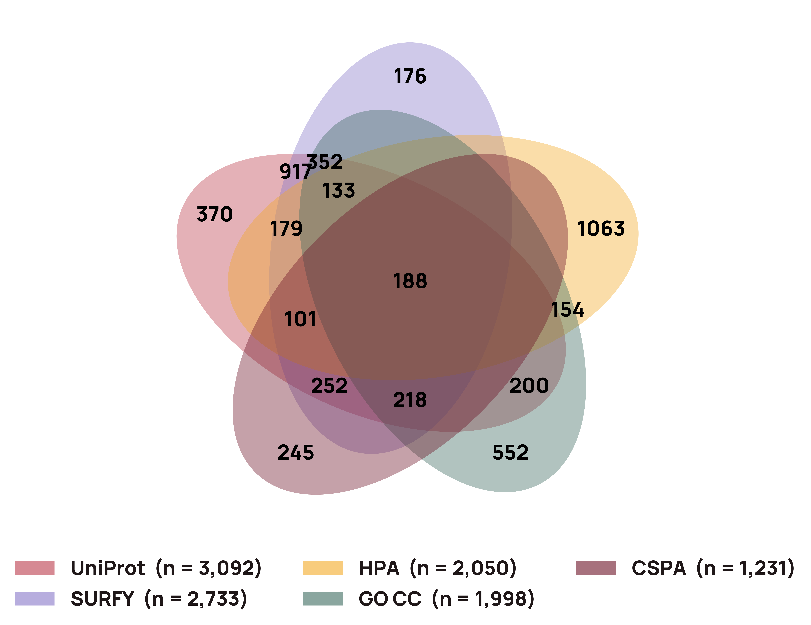

# The accessible human surfaceome

[](https://doi.org/10.5281/zenodo.22116981) [](https://github.com/Deliverome-Project/accessible-surfaceome/releases) [](LICENSE)

Proteins on the extracellular face of the plasma membrane are important therapeutic targets, because they can direct large-molecule therapeutics to specific cell types and ferry them into the cell. But existing databases disagree substantially on which proteins make up the human plasma membrane proteome, and none focus specifically on the proteins that are *accessible* from outside an intact cell.

This repository is an agentic LLM pipeline that curates the accessible human surfaceome from the published literature, plus the viewer and public API that serve the results. Every claim in every record is anchored to a verbatim quote from the paper it came from, so you can trace the reasoning behind any call.

**Viewer:** [surfaceome.deliverome.org](https://surfaceome.deliverome.org) · **API:** `https://api.deliverome.org/surfaceome/v1/genes/KLK2`

## How to cite

The preprint is pending. Until it appears, please cite the archived code and data records:

| What | Cite | Licence |
|---|---|---|
| Code, including the viewer | [10.5281/zenodo.22116981](https://doi.org/10.5281/zenodo.22116981) | MIT |
| Data — triage runs, benchmark runs, deep-dive records | [10.5281/zenodo.20805383](https://doi.org/10.5281/zenodo.20805383) | CC BY 4.0 |

Both are concept DOIs and always resolve to the newest version. Individual figures are separately citable: each is deposited with Software Heritage, and the figure ↔ SWHID ↔ gist map is [`figure_swhids.json`](data/analysis/figures/figure_swhids.json).

## Quickstart

**Browse it, no install.** The [viewer](https://surfaceome.deliverome.org) is a sortable catalog with a per-gene evidence page. The public JSON API serves the same records.

**Annotate one gene yourself:**

Prerequisites: [uv](https://docs.astral.sh/uv/), and `git-lfs` if you want the
underlying data (the `data/` trees are LFS-tracked, ~214 MB). The viewer
additionally needs Node 24 — `npm install` refuses to run on an older major.

Only want the code? `GIT_LFS_SKIP_SMUDGE=1 git clone …` fetches pointers
instead of the data, and `git lfs pull` gets it later if you change your mind.

```bash
git clone https://github.com/Deliverome-Project/accessible-surfaceome
cd accessible-surfaceome
uv sync                              # Python environment
cp .env.example .env                 # add ANTHROPIC_API_KEY (+ NCBI keys)
uv run python scripts/annotate_gene.py KLK2 --no-publish
```

Roughly $1.30 per gene and about nine minutes.

**Reproduce a figure.** Every figure's gist bundles its data and its script, so nothing needs to be cloned. See [Figure reproducibility](#figure-reproducibility).

**Run the viewer locally:** `cd viewer && npm install && npm run dev`.

## Why this exists

UniProt, GO Cellular Component, the Human Protein Atlas, the Cell Surface Protein Atlas, and SURFY were each built with a different approach and for a different purpose, so each defines "surface" differently. HPA's antibody-based localization spans both leaflets of the plasma membrane; CSPA's cell-surface-capture chemistry enriches glycosylated proteins on the outer face. Because each definition suits its own aims, the calls diverge: only 188 proteins are shared across all five, fewer than 10% of the average database's size.



A useful definition for therapeutic purposes is narrower — the proteins accessible on the extracellular side of the membrane, where antibodies and other large molecules that cannot cross it can bind. Many proteins are also on the surface only transiently, or in particular cell types or cell states, which a binary call cannot express.

These resources share one more limit: manual curation cannot keep pace with a literature that grows faster every year, so each is a fixed snapshot. LLM agents can read across far more of that literature at once, and can be re-run as new findings appear.

## How it works

Two agents, in sequence.

**Triage** classifies each of 19,324 protein-coding genes as surface, contextually surface, or non-surface, with a structured reason for every call. It is pure inference with no tools, cheap enough to run across the whole genome. On SurfaceBench, a 147-protein benchmark enriched for disagreement between the five reference databases, it classifies surface status more accurately than any of them individually or in combination, and it recovered 960 candidate surface proteins that appear in none of them.

**Deep dive** then reads the retrieved literature for the 5,130 candidates that survive triage or carry a database surface call. It runs in three stages: deterministic literature retrieval, concurrent block builders, and a synthesizer that assembles the record. Every claim is anchored to verbatim quotes.

The result is 1,782 high-confidence surface proteins and 1,243 with weaker or context-dependent evidence. On held-out sets of clinical and viral-entry targets, the pipeline recovered 98–100% of established surface antigens.

```
19,324 genes ──▶ triage agent ──▶ 5,130 candidates ──▶ deep-dive pipeline ──▶ records
                 yes/contextual/no                     retrieval → builders → synthesis
                                                                                 │
                                                        viewer + public API ◀────┘
```

## What's in a record

Each gene returns a `SurfaceomeRecord` carrying 24 LLM-derived annotation fields alongside 7 deterministic structural and topological features. The fields that carry the call:

| Field | What it says |
|---|---|
| `deep_dive_tier` | Where the gene lands overall: `canonical` (1,782), `likely` (1,243), `low` (973), `no` (1,078), `uncertain` (54) |
| `confidence` | `high` / `moderate` / `low`, with `confidence_reasoning` alongside it |
| `executive_summary.surface_call_reason` | *Why* it is called surface — constitutive, cell-state induced, tissue-restricted, lysosomal exocytosis, and so on |
| `surface_evidence.evidence_grade` | How direct the underlying evidence is, from direct multi-method down to weak or conflicting |
| `triage_signal` | The upstream triage verdict, kept so the two stages can be compared |

Around those sit the evidence and context: `surface_evidence` with per-claim verbatim quotes and provenance, `biological_context`, `accessibility_risks`, `filters` for catalog querying, and `search_log` recording what was retrieved.

`deterministic_features` is computed rather than inferred: DeepTMHMM topology for the canonical sequence and for alternative isoforms and mouse and cyno orthologs, AlphaFold and experimental structures, SURFACE-Bind binding-site scoring, predicted homo-oligomers, and Ensembl Compara orthologs and paralogs.

The citation ledger is served separately at `/v1/genes/:symbol/evidence`, which keeps the core record small.

## Public API

```
GET /v1/health
GET /v1/genes                      — list of annotated genes
GET /v1/genes/:symbol              — full SurfaceomeRecord
GET /v1/genes/:symbol/evidence     — the citation ledger for one gene
GET /v1/orthologs/:symbol          — mouse + cyno orthologs
GET /v1/benchmark[/:symbol]        — curated truth labels
GET /v1/triage/:symbol             — per-call model verdicts
GET /v1/catalog                    — the full catalog
GET /v1/catalog/:symbol            — one catalog row
GET /v1/genes/:symbol.md           — the record as Markdown
GET /v1/meta/sizes                 — payload sizes per endpoint
```

Served from `https://api.deliverome.org/surfaceome/v1/…`; the `surfaceome/` prefix is stripped before route matching, so `/v1/...` is the contract. [`GET /v1`](https://api.deliverome.org/surfaceome/v1) is a self-describing index of every endpoint.

For agents and scripts there is a machine-readable front door: [llms.txt](https://surfaceome.deliverome.org/llms.txt) points at the whole surface, [surfaceome-api.skill.md](https://surfaceome.deliverome.org/surfaceome-api.skill.md) is a downloadable agent skill, and the [API docs page](https://surfaceome.deliverome.org/api/) carries worked `curl` examples. Any gene is also available as Markdown: `/v1/genes/{SYMBOL}.md`. Records are read from a Cloudflare D1 database through a read-only Worker in [`cloudflare/workers/surfaceome_api/`](cloudflare/workers/surfaceome_api/). Deploy with `npx wrangler deploy` from that directory — there is no auto-deploy.

## Figure reproducibility

Every published figure is paired with a reproduction gist: a standalone script that declares its dependencies inline via [PyPA inline script metadata](https://packaging.python.org/en/latest/specifications/inline-script-metadata/), fetches its input from a content-pinned URL, and re-renders the figure. The gist URL and a provenance JSON conforming to [schema v1](docs/figure-reproducibility-schema.md) are embedded in the figure's PDF and PNG metadata, so a reader who downloads a figure can recover everything needed to verify it.

Each gist is also deposited with Software Heritage for a content-addressed permanent identifier. See [`figure_swhids.json`](data/analysis/figures/figure_swhids.json).

## Layout

| Path | What lives here |
|---|---|
| `src/accessible_surfaceome/sources/` | One module per data source (UniProt, GO, SURFY, CSPA, DeepTMHMM, HPA, COMPARTMENTS, Ensembl Compara), each with `download` / `build` |
| `src/accessible_surfaceome/merge/` | Candidate-universe assembly, normalization, gene-symbol resolution |
| `src/accessible_surfaceome/agents/` | `surface_triage/` (triage), `surfaceome_v2/` (deep dive), `plan_trim_select/` (retrieval), `surfaceome_synthesizer/` (assembly) |
| `src/accessible_surfaceome/cloud/` | D1 client and uploaders |
| `src/accessible_surfaceome/tools/` | Shared helpers and the Pydantic record models |
| `scripts/` | Entry points at the root; the rest grouped into `figures/`, `build/`, `cloud/`, `audit/`, `probes/`, `tsv-export/`, `release/`, `archive/`. See [`scripts/README.md`](scripts/README.md) |
| `cloudflare/` | D1 schemas and the public API Worker |
| `viewer/` | Next.js app deployed at `surfaceome.deliverome.org` |
| `data/` | Source snapshots, normalized tables, agent outputs, figures (mostly git-LFS) |
| `paper/` | Manuscript figure assets and the figure index |
| `docs/` | Plans, eval reports, design decisions |
| `modal/` | Serverless app for running the pipeline at scale |
| `tests/` | Pytest suite |

## Commands

```bash
# Annotate one gene end-to-end (~$1.30, ~9 min):
uv run python scripts/annotate_gene.py HSPA1A

# Run the triage benchmark sweep (147-gene SurfaceBench).
# NOTE: --variants defaults to all four, so this is ~588 model calls, and
# --d1 writes them to the project database. Try --dry-run or --smoke first.
uv run python scripts/triage_runner.py --model claude-sonnet-4-6 --replicates 1

# Rebuild the candidate universe:
uv run python -m accessible_surfaceome.merge

# Everything CI runs (ruff, ty, pytest, viewer type sync):
./scripts/check-py.sh
```

Contributing setup, conventions, and repo gotchas are in [CONTRIBUTING.md](CONTRIBUTING.md). Data-source licence terms are in [LICENSING.md](LICENSING.md).

## Documentation

- [Project scoping plan](docs/plans/2026-04-16-surface-proteome-annotation.md) — design notes, audit gates, cost model
- [Figure reproducibility schema](docs/figure-reproducibility-schema.md) — what is embedded in each figure
- [Release ritual](scripts/release/README.md) — how to mint a citable snapshot
- [`docs/evals/`](docs/evals/) — eval reports, including the HSPA1A conditional-surface stress test

MIT licensed; copyright Michael Smallegan and Rebecca Carlson.
