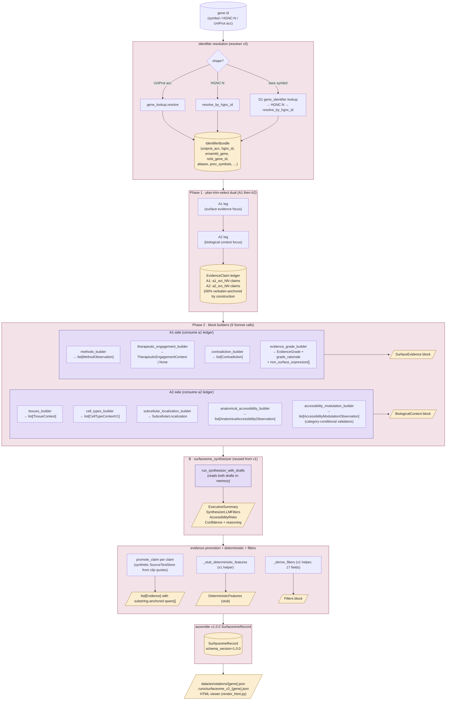
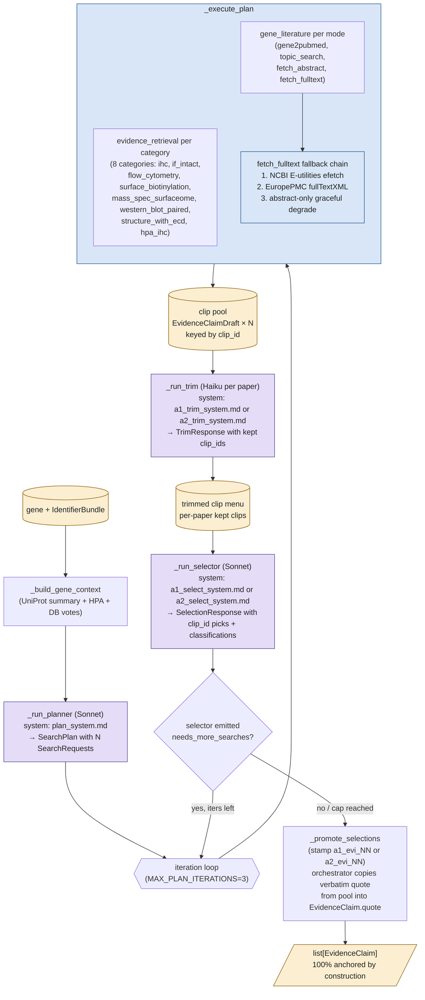
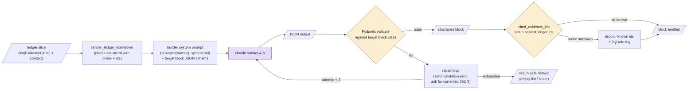
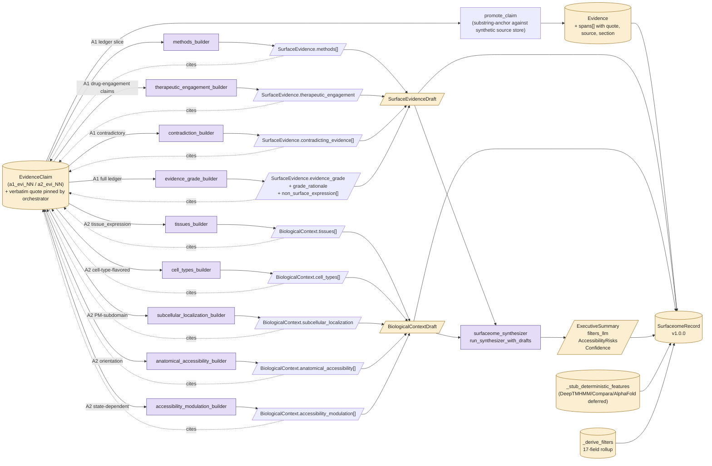

# surfaceome_v2 process flow

End-to-end pipeline that takes a gene identifier and produces a v1.0.0
`SurfaceomeRecord`. Three logical phases (the original handoff scoping)
plus a B synthesizer + deterministic features rollup, all wired into
one `surfaceome_v2.annotate(gene)` entry point.

## Top-level flow

## Phase 1 detail — plan-trim-select dual

Per agent (A1 surface evidence focus / A2 biological context focus).
Both legs use the same warmed `CachedHTTP` so the second leg hits the
disk cache on every fetch.

## Phase 2 detail — block builder contract

Each builder is one Sonnet call with a closed-enum target schema. Shared
helper `call_builder` runs a Pydantic-repair loop (`MAX_REPAIRS=2`).

## Data lineage — where each output field comes from

## Notes

- **Resolver v3 boundary.** All gene-symbol input is routed through D1
  → HGNC ID → `resolve_by_hgnc_id` to avoid the symbol-collision
  silent-wrong-protein class (COX1 / WAS / etc.). The orchestrator
  refuses the legacy symbol-through-UniProt path.
- **HTTP cache shared across the dual run.** A2's leg fetches every
  paper A1 already hit via cache; the marginal cost is the
  A2-specialized trim + select model calls.
- **Fulltext fallback chain (post-2026-05-16):** NCBI E-utilities
  `efetch?db=pmc` first (authoritative source), EuropePMC
  `fullTextXML` second (catches EuropePMC-only OAI ingestions),
  abstract-only graceful degrade third. Promoted to NCBI-first after
  a GPR75 survey found EuropePMC 404'd on 58/58 fulltext attempts.
- **Verbatim anchoring is by construction.** Plan-trim-select never
  paraphrases — the selector picks `clip_id`s and the orchestrator
  copies the verbatim `quote` from the clip pool into
  `EvidenceClaim.quote` on promotion. The downstream `promote_claim`
  substring-check is bookkeeping that always passes.
- **Block-builder routing happens on prose, not enum.** `ClaimType`
  has only 5 values; the rich `BiologicalContext` /
  `SurfaceEvidence` structure (modulation categories, therapeutic
  engagement stage, antibody validation, etc.) is populated by the
  builders parsing the selector's `claim` text against the closed
  enums of each block schema.
