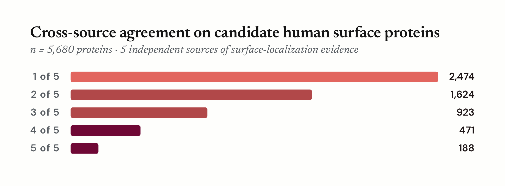

# A candidate human surface-protein universe

**Date:** 2026-04-17 (revised 2026-05-06) · **Candidate universe:** 5,680 proteins · **Sources flagged:** 5 (DeepTMHMM and JensenLab COMPARTMENTS attached as auxiliary per-row evidence)

## Abstract

Selecting therapeutic-delivery targets on the human cell surface requires an unbiased starting list — one that captures every credible claim of surface expression without prejudging which evidence type is most trustworthy. Here we assemble such a list by merging five independent sources of human surface-protein evidence: two curated databases (UniProt, Gene Ontology), one mass-spectrometry atlas (CSPA), one antibody-based immunofluorescence atlas (Human Protein Atlas v25), and one sequence-based predictor (SURFY). Two further sources — DeepTMHMM (a deep-learning transmembrane topology predictor) and JensenLab COMPARTMENTS (a literature-driven meta-database) — are attached per row as auxiliary evidence but are omitted from the universe-level figures: DeepTMHMM because it is run on a partial 2,360-protein cohort in this milestone, and COMPARTMENTS because its corroboration gate makes it a confidence-boost-only signal that contributes zero unique members to the universe (verified against the live build). All entries are reconciled against current UniProt primary accessions, and each gating source contributes one independent surface-evidence call per protein. The resulting universe contains 5,680 proteins with at least one of the five flagged sources reporting surface evidence under its own rule. One hundred eighty-eight are supported by all five sources; 659 by at least four. The tightest pairwise agreement is between UniProt and SURFY (Jaccard 0.67), reflecting SURFY's origin as a curated-gold-standard classifier seeded with UniProt subcellular-location annotations. Most proteins are supported by only one or two sources — an expected pattern that reflects genuine differences in what each source can see, and that we preserve deliberately for downstream prioritization.

## Why a candidate universe first

The human surfaceome is not a settled list. Different evidence types — curator-assigned subcellular locations, mass-spectrometry captures of cell-surface glycopeptides, antibody-based immunofluorescence images, sequence-based predictors, and automated literature mining — each see a different slice of the biology and each carry their own failure modes. A sequence predictor cannot tell whether a protein with a transmembrane helix actually reaches the plasma membrane; a mass-spec atlas only sees proteins expressed in the cell lines it sampled; a curator-assigned subcellular location reflects the evidence that reached the curator, which varies by gene. Taking any one source as the definitive surfaceome builds its blind spots into every downstream decision.

This milestone therefore takes a different posture: a broad, high-recall union of credible surface claims, with the source of every inclusion preserved. Disagreement among sources is a feature, not noise. Proteins supported by all five sources are the most strongly corroborated; proteins supported by only one or two sources are kept as candidates but carry a different weight. The universe assembled here is the substrate for subsequent milestones — tissue-specific filtering, therapeutic-modality ranking, and ultimately the selection of delivery targets — not a final validated surfaceome.

Throughout this report, "surface" means *accessible from the extracellular face of an intact human cell* — a living-cell surface protein with an extracellular or membrane-embedded domain reachable by an antibody, a ligand, or a binder. Intracellular organelle membranes and secreted proteins are not surface proteins by this definition, even when predictors or annotations occasionally conflate them.

## Data sources

### Universe-flag sources (five)

| # | Source | Snapshot | Evidence modality | Rows |
|---|---|---|---|---|
| 1 | UniProt human surface-candidate query (subcellular location + topology) | release 2026_01 | Curated database | 3,175 |
| 2 | Gene Ontology annotations (three cellular-component roots, see *GO terms used* below) | 2026-01 | Curated database | 2,557 |
| 3 | SURFY (Bausch-Fluck et al., 2018) | 2018 | ML classifier | 2,886 |
| 4 | CSPA (Bausch-Fluck et al., 2015) | 2015 | Mass-spec surfaceome | 1,500 |
| 5 | Human Protein Atlas, subcellular localization | v25 / 2026-01 | Antibody immunofluorescence | 3,004 |

### Auxiliary per-row evidence (not flagged at universe level)

| # | Source | Snapshot | Evidence modality | Rows |
|---|---|---|---|---|
| A | DeepTMHMM (canonical + isoforms) | pre-existing 2,360-protein cohort | TM topology predictor | 2,360 |
| B | JensenLab COMPARTMENTS (four-channel integrated) | 2026-01 | Literature-driven meta-database | 1,963 |

Row counts are the size of the raw per-source input before accession reconciliation and before each source's positive-flag rule is applied. Per-source surface counts after normalization and rule application are given in the Results section.

Two sources are held out of universe-level figures with different reasons. **DeepTMHMM** is excluded because the predictor has been run on a partial cohort in this milestone; its per-row calls are still emitted in the candidate-universe TSV. **JensenLab COMPARTMENTS** is excluded because its corroboration gate (see § COMPARTMENTS below) means every COMPARTMENTS-supported protein is also supported by another source — verified against the live build, all 148 of 148 COMPARTMENTS-flagged proteins are also flagged by ≥ 1 of the five gating sources, so COMPARTMENTS contributes zero unique members to the universe and serves only as a per-row confidence cue for downstream consumers.

For each source below, the methodology is described with three explicit subsections: *what it measures*, what signals we **include** as positive surface evidence, and what signals we **exclude** (either carried as provenance only or dropped entirely) with the reason for exclusion. This structure replaces tabular summaries so that every inclusion and exclusion choice is traceable from the prose alone.

## Methods

### Common scaffolding

All seven sources are harmonized against UniProt release 2026_01 before the merge. Secondary accessions are rewritten to their current primary, deleted Swiss-Prot entries are removed, and ambiguous historical remaps — one accession that has split into multiple current primaries — are retained for traceability but excluded from positive calls until manually reviewed. Each source then contributes a single yes/no surface-evidence call per protein, following the rules given below. Five of the seven calls (UniProt, GO, SURFY, CSPA, HPA) gate universe membership and are preserved side by side together with a *k*-of-5 agreement count. DeepTMHMM's call (partial cohort) and COMPARTMENTS's call (corroboration-gated) are preserved per row as auxiliary evidence but do not contribute to membership or to *k*-of-5 agreement.

Accessions that appear in a raw source but are filtered out of *every* positive-flag rule (pure-IEA GO, CSPA unspecific or blank-category, HPA secreted-only, split-ambiguous accession-history remaps) carry no positive evidence for surface expression and are emitted to a separate `candidate_universe_zero_support.tsv` for traceability. The main `candidate_universe.tsv` — the input to downstream per-gene reconciliation — is the subset with at least one of the five flagged sources reporting surface evidence (`n_sources_surface ≥ 1`).

For each source we describe (a) what the source measures, (b) the rule under which we count a protein as surface-supported, and (c) the main reason that source disagrees with the others.

### UniProt

*What it measures.* The Swiss-Prot reviewed human proteome, filtered to entries whose curator-assigned subcellular-location comments and topology features place the protein on the plasma membrane.

*Included.* An entry is counted as UniProt-supported if any of six query clauses matches: the subcellular-location comment contains **"Cell membrane"** (`cc_scl_term:"Cell membrane"`), **"Cell surface"**, **"Apical cell membrane"**, **"Basolateral cell membrane"**, or **"GPI-anchor"**, *or* the entry carries a topological-domain feature annotated as **"Extracellular"** (`ft_topo_dom:Extracellular`). The disjunction captures single- and multi-pass transmembrane proteins with an extracellular topology as well as GPI-/lipid-anchored proteins that lack a conventional transmembrane helix. A protein is counted as UniProt-supported if it is present in the filtered query, after its accession has been carried forward through UniProt's secondary-accession history.

*Excluded.* Unreviewed (TrEMBL) entries are excluded by design because their annotation quality is uneven. Reviewed entries that do not match any of the six clauses above are excluded. Entries whose subcellular location places them exclusively at internal organelle membranes — endoplasmic reticulum, Golgi, lysosome, mitochondrion, nucleus — and that do not also carry a cell-surface-class comment or an extracellular topological domain do not enter the pool.

*Why it disagrees.* UniProt's evidence depth varies by gene. Well-studied proteins carry direct experimental annotations; less-studied ones rely on curated topology or confident orthologue transfer. The `ft_topo_dom:Extracellular` clause also admits some multi-location proteins whose primary localization is not the plasma membrane; these are retained because filtering them here would lose genuine cycling/multi-location surface proteins.

### Gene Ontology

*What it measures.* Manually and algorithmically curated associations between genes and Gene Ontology cellular-component terms describing subcellular location. Each association carries an evidence code: experimental (EXP, IDA, IPI, IMP, IGI, IEP, HTP, HDA, HMP, HGI, HEP), curated author/curator statement (IBA, IBD, IKR, IRD, TAS, NAS, IC), sequence- or orthologue-inferred (ISS, ISO, ISA, ISM, IGC, RCA), or purely electronic (IEA).

*Included.* Three cellular-component roots plus their `is_a` + `part_of` descendants (BFS closure over `go-basic.obo`): **cell surface** (`GO:0009986`), **external side of plasma membrane** (`GO:0009897`), and **integral component of plasma membrane** (`GO:0005887`). A protein is counted as GO-supported if it has at least one association to one of these roots (or a descendant) supported by an experimental, curated, or non-electronic sequence-inference evidence code. The emitted GO annotation file preserves the specific GO_ID each row carries, so downstream analyses can re-tier by term if needed.

*Excluded.* The broader parent **plasma membrane** (`GO:0005886`) is excluded because it admits many cytosolic-facing PM-associated proteins that are not accessible on the extracellular face of the cell; most genuine PM members are captured by the specific children already included. The molecular-function terms **signaling receptor activity** (`GO:0038023`) and **transmembrane signaling receptor activity** (`GO:0004888`) are excluded because they annotate receptor *activity* regardless of location, which admits endosomal pattern-recognition receptors (TLR3/7/8/9) whose resting compartment is endosomal rather than plasma-membrane. The anchored-component terms **anchored component of membrane** (`GO:0031225`) and **anchored component of plasma membrane** (`GO:0046658`) are obsolete in the current GO release; GPI- and lipid-anchor evidence is captured from UniProt's `ft_lipid` feature instead. **Extracellular region** (`GO:0005576`) and the obsolete **extracellular space** (`GO:0005615`) are excluded because they describe secreted rather than cell-surface-attached proteins. Purely electronic (IEA-only) annotations to included terms are retained for traceability but do not count as positive evidence.

*Why it disagrees.* GO coverage is deep for well-studied receptors and channels but thinner for less-curated surface proteins. The experimental-or-curated threshold also excludes proteins whose only surface-relevant association is a purely electronic inference. Those proteins may well be surface-expressed; the evidence in GO alone is simply weaker than we count here.

### SURFY

*What it measures.* A random-forest classifier trained by Bausch-Fluck et al. (2018) on a curated gold-standard surfaceome, using sequence, topology, and annotation features. SURFY assigns every human protein a surface / not-surface label and a confidence score in its published SurfaceomeMasterTable.

*Included.* Proteins whose published SURFY label is **"surface"** (`surfy_is_surface == 1`). We use the label as provided by the authors; no additional score cutoff is re-applied on our side.

*Excluded.* Proteins labeled **"nonsurface"** and entries left unclassified in the SurfaceomeMasterTable are excluded from the positive flag. These rows are also dropped from the merge input (rather than carried as provenance) because SURFY covers the full reviewed proteome, so the nonsurface/unclassified subset is ~17,000 rows that would only inflate the zero-support bucket without adding information.

*Why it disagrees.* SURFY tends to over-call: a protein with a transmembrane domain and sequence hallmarks of membrane insertion tends to score positive whether or not it actually reaches the plasma membrane. A well-known example is ABCB9, a lysosomal ABC transporter that SURFY flags despite its internal-membrane residence. For this reason SURFY is one vote among seven; strong disagreement between SURFY and the experimental sources (CSPA, HPA) is itself an informative signal.

### CSPA

*What it measures.* The Cell Surface Protein Atlas (Bausch-Fluck et al., 2015), a mass-spectrometry surfaceome built by chemically labeling N-linked glycopeptides on the surface of intact, living cells across many human cell lines and mapping the detected peptides back to their source proteins. Each detection is categorized in CSPA Table_B as one of four classes: **1 - high confidence**, **2 - putative**, **3 - unspecific**, or blank (detected in Table_A but not assigned a Table_B class).

*Included.* A protein is counted as CSPA-supported if any pre-accession-history-collapse row has category **"1 - high confidence"** or **"2 - putative"**. The flag is a boolean OR across the pre-collapse rows, so a primary that inherited evidence from multiple merged historical accessions (for example HLA alleles) gains the flag if any contributing row was high-confidence or putative.

*Excluded.* **"3 - unspecific"** detections (non-specific captures / contaminants) and **blank-category** rows (detected but not classified) are retained in the merge with `cspa_surface_flag = 0` for provenance, so downstream can distinguish "absent from CSPA" from "seen only as unspecific" from "detected but not classified." They do not contribute to the positive flag.

*Why it disagrees.* CSPA only observes proteins expressed at the surface of the specific cell lines it sampled. Absence from CSPA is therefore not evidence of non-surface status, only absence from the sampled contexts. Low overlap with the database-driven sources reflects this sampling scope.

### DeepTMHMM (auxiliary per-row evidence)

DeepTMHMM is *attached* to each row of the candidate-universe TSV but does not contribute to universe membership or to the *k*-of-5 agreement score, because the predictor has been run on a partial 2,360-protein cohort in this milestone. Its calls are preserved so that downstream consumers can use them per-gene without our re-deriving the merge once the predictor is extended to the full reviewed proteome.

*What it measures.* A deep-learning transmembrane-topology predictor that assigns each input sequence one of five class labels: `TM` (alpha-helical transmembrane), `SP+TM` (signal peptide + transmembrane helices), `BETA` (transmembrane beta-barrel), `SP` (signal peptide only — predicted secreted), or `GLOB` (globular, no TM or SP).

*Included.* A protein is counted as DeepTMHMM-supported (in the per-row column, not in universe membership) if any run on its canonical sequence or isoforms returns **`TM`** or **`SP+TM`** — the labels consistent with an alpha-helical plasma-membrane protein.

*Excluded.* **`BETA`** is excluded because in humans, beta-barrel membrane proteins are essentially mitochondrial outer membrane (VDAC1/2/3, TOMM40, SAMM50, MTX1/2), not plasma-membrane proteins accessible on the intact cell — a topology prediction of BETA is informative about fold but misleading about compartment. **`SP`** is excluded because it identifies secreted proteins, which are not surface-accessible on intact cells by definition. **`GLOB`** is excluded because it indicates no membrane segment. The raw label is preserved in the emitted table so downstream can re-inspect the exclusion reason for any given protein.

*Why it is held out of the figures.* On the partial cohort, DeepTMHMM flags 2,218 proteins as surface and overlaps SURFY at Jaccard 0.78 — both expected, both methodologically tight because the two share a sequence-and-topology basis. Including DeepTMHMM in universe-level agreement counts before the full-proteome run lands would mechanically cap intersections that involve it. Once the run is extended, DeepTMHMM will rejoin the universe-level figures as a seventh flagged source.

### Human Protein Atlas

*What it measures.* An antibody-based immunofluorescence atlas of subcellular localization (v25). Each gene is stained with one or more antibodies across multiple cell lines; each staining pattern is scored into localizations (plasma membrane, cell junctions, nucleus, cytosol, vesicles, endosomes, lysosomes, Golgi, ER, mitochondrion, and so on) with a per-localization reliability tier: **Enhanced** (multiple antibodies plus orthogonal validation), **Supported** (staining consistent with external data), **Approved** (staining observed with no orthogonal contradiction), or **Uncertain** (weaker signal or contradiction).

*Included.* A protein is counted as HPA-supported if either (a) **Plasma membrane** appears at **Enhanced**, **Supported**, or **Approved** reliability in the per-localization tier column, or (b) **Cell Junctions** appears at **Enhanced**, **Supported**, or **Approved** reliability. Cell junctions count because E-cadherin, claudins, JAM-family proteins, occludin, and desmosomal cadherins carry genuine extracellular-accessible domains on intact epithelia. The per-localization reliability column (not gene-wide *Reliability*) is used, so a gene whose strong localization is nuclear/cytosolic while the PM call lands in Uncertain is not counted as HPA-supported on the PM side.

*Excluded.* **Plasma membrane or Cell Junctions at Uncertain reliability** is excluded to avoid admitting weak or contradicted staining. The **Extracellular-location column** is excluded entirely: in the v25 release it is populated by "Predicted to be secreted" — a SignalP-based sequence prediction, not an imaging observation — so counting it would double-count a predictor signal that DeepTMHMM already represents, and would conflate secreted proteins with surface-accessible ones. **Vesicle, endosome, and lysosome staining** is excluded from the positive flag; these localizations can indicate cycling between internal compartments and the surface in specific contexts (for example LAMP1 degranulation markers) but are not evidence of steady-state surface residence, and admitting them on their own would reintroduce internal-membrane false positives like ABCB9. The trafficking-associated signal is carried as a provenance column (`hpa_trafficking_associated`) for downstream adjudication. **Nuclear, cytosolic, Golgi, ER, and mitochondrial** localizations are excluded as not surface-relevant. Secreted-only rows stay in the merge with `hpa_secreted_only = 1` as provenance only.

*Why it disagrees.* HPA's coverage is antibody-dependent. Proteins without a validated antibody at the time of the v25 release, and proteins whose surface localization is weak or limited to cell types not sampled, will be absent from HPA even when well-characterized elsewhere.

### JensenLab COMPARTMENTS (auxiliary per-row evidence)

COMPARTMENTS is *attached* to each row of the candidate-universe TSV but does not gate universe membership or contribute to the *k*-of-5 agreement score. The corroboration gate (below) requires every COMPARTMENTS-supported protein to also be flagged by another source — and verified against the live build, all 148 of 148 COMPARTMENTS-flagged proteins are also flagged by ≥ 1 of UniProt/GO/SURFY/CSPA/HPA. COMPARTMENTS therefore contributes zero unique members to the universe; its only effect is to push corroborated proteins from *k* to *k+1* in the agreement count, which we hold out of universe-level figures.

*What it measures.* A meta-database that integrates four independent evidence streams onto a shared confidence scale per (protein, subcellular-location) pair: a **knowledge** channel aggregating curator-assigned annotations, an **experiments** channel primarily ingesting immunofluorescence data, a **text-mining** channel derived from automated named-entity co-mention in biomedical literature, and a **predictions** channel from sequence-based localization predictors (WoLF PSORT + YLoc-HighRes). Scores are reported on a 0–5 star scale per channel per term.

*Included.* The **text-mining** channel and the portion of the **experiments** channel that does not re-ingest Human Protein Atlas data are used as independent evidence. A protein is counted as COMPARTMENTS-supported (in the per-row column, not in universe membership) only when both of the following hold: (a) `max(compartments_experiments_stars_max, compartments_textmining_stars_max) ≥ 3` across the surface GO-term set `{GO:0005886, GO:0009986, GO:0031225, GO:0005887}`, and (b) at least one of the five gating sources has independently flagged the protein as surface under its own rule (`compartments_corroborated == 1`). The corroboration gate prevents text-mining co-occurrence alone from admitting transcription factors (TP53, MYC), cytokines (IL1B, IFNG, IL4), or serum proteins (ALB, APOE, CRP) — all of which the tagger legitimately co-mentions with "plasma membrane" in Medline abstracts but which are not surface-accessible on intact cells.

*Excluded.* The **knowledge** channel is excluded from the flag because it re-ingests GO and UniProt-SubCell, both of which are already first-class sources in this merge — counting it would triple-count curator evidence. The **predictions** channel is excluded because it wraps WoLF PSORT + YLoc-HighRes — sequence-based predictors in the same family as SURFY and DeepTMHMM; empirically it drives ~73% of pre-filter hits and is ~100% PSORT-on-`GO:0005886`, so counting it would triple-count ML-predictor evidence. Within the experiments channel, rows whose upstream source is "HPA" are dropped before scoring to avoid double-counting the first-class HPA IF evidence. All four channels' per-term stars are retained in the emitted table as provenance columns (`compartments_*_stars_max`) so downstream can audit why a call did or did not fire.

*Why it is held out of the figures.* By construction COMPARTMENTS cannot admit a protein on its own. Including it as a sixth gating vote would inflate the agreement score for already-corroborated proteins on ontology grounds that the GO source itself rejects (text-mining co-occurrence with `GO:0005886`), without ever expanding the universe. We therefore treat COMPARTMENTS as a per-row confidence cue only.

## Results

### Cross-source agreement

The candidate universe contains 5,680 unique human proteins with at least one of the five flagged sources reporting surface evidence under its own rule. Most are supported by only a few sources: 2,474 by exactly one, and a decreasing long-tail through the higher agreement classes. One hundred eighty-eight proteins are supported by all five sources. Per-source surface counts are UniProt 3,175, SURFY 2,800, HPA 2,077, Gene Ontology 2,022, and CSPA 1,241. DeepTMHMM (2,218 supported within its 2,360-protein cohort) and COMPARTMENTS (148 supported, all of which are also supported by ≥ 1 of the five gating sources) are attached per row as auxiliary evidence but do not contribute to the universe count or the *k*-of-5 score. A separate traceability file (`candidate_universe_zero_support.tsv`) holds 1,704 additional accessions that appear in a raw input but fail every positive-flag rule — these carry no positive evidence and are not part of the main universe.

The agreement distribution has a practical meaning for downstream use. The 5-of-5 and 4-of-5 classes (659 proteins, ≈ 11.6% of the universe) define a high-confidence core that can be treated as strongly supported without further evidence. The middle classes (2-of-5 and 3-of-5) are the most biologically interesting: they collect proteins where one or two evidence types disagree with the rest, and that disagreement often carries real biological meaning — a predictor over-call on an internal-membrane protein, a protein absent from the cell lines CSPA sampled, or a protein without an HPA-validated antibody. The 1-of-5 class is retained as candidates but should not be treated as validated surface proteins without additional evidence.

*Figure 1. How many of the five flagged sources mark each protein as surface-supported, across the 5,680-protein universe (`n_sources_surface ≥ 1`). One hundred eighty-eight proteins are flagged by all five; 659 by at least four. Most proteins sit in the lower agreement classes, reflecting genuine differences in what each source can see.*

*Figure 2. Co-occurrence of per-source surface flags across the five gating sources. The five-way intersection (188 proteins) and the next-largest agreement classes dominate the high-confidence end. DeepTMHMM and COMPARTMENTS are auxiliary in this milestone and are omitted from the figure.*

### Pairwise agreement

Pairwise Jaccard indices quantify how much each pair of the five gating sources agrees on which proteins count as surface. The tightest pair is **UniProt with SURFY** (Jaccard 0.67), reflecting SURFY's origin as a curated-gold-standard classifier seeded with UniProt subcellular-location annotations — partly definitional, not independent corroboration. GO's overlaps with the other sources (0.16–0.29 against UniProt/SURFY/CSPA/HPA) reflect its cellular-component-only scope, once MF-based receptor-activity terms are excluded. SURFY pairs with CSPA at 0.29 and with HPA at 0.16. CSPA's overlaps with the other sources span 0.12–0.29, as expected given its cell-line-restricted sampling. HPA's overlaps run 0.12–0.17, reflecting broad but uneven antibody coverage.

*Figure 3. Pairwise Jaccard of per-source surface sets across the five gating sources. The high UniProt–SURFY value reflects SURFY's training on UniProt-seeded gold-standard labels; low values involving CSPA reflect cell-line-restricted sampling rather than data quality.*

### Well-characterized examples

Well-characterized human surface proteins behave as expected: canonical receptors and HLA class I/II / immunoglobulin entries appear in the universe with strong cross-source corroboration where every source has the coverage to weigh in, and fall to lower *k*-of-5 only on the sources whose coverage is genuinely thin (HPA's known coverage gaps on individual HLA alleles and immunoglobulin class-switch variants in particular). The lower scores therefore reflect method coverage, not contested surface residence. Per-gene attributions for the canonical examples will be regenerated against the current 5-source build before the LLM reconciliation step keys on them.

## Limitations and next steps

This milestone is an assembly step, not a classification step. It produces a broad, traceable candidate list for downstream filtering, not a validated human surfaceome. Four limitations matter for interpretation.

*DeepTMHMM coverage.* DeepTMHMM predictions in this milestone come from a pre-existing cohort of 2,360 proteins, which is why the predictor is held out of the universe-level figures and the *k*-of-5 score. Extending DeepTMHMM — alongside SignalP 6.0 and GPI-anchor predictors — to the full reviewed proteome is a planned next step; this will both restore DeepTMHMM as a universe-flagged source and enable predictor-only surface candidates to surface as a distinct class.

*Organelle-lumen exclusion.* A small number of proteins enter on UniProt evidence whose only subcellular-location support is an organelle lumen. These will be filtered out in a subsequent refinement pass.

*Tissue-specific and cell-type-specific filtering.* The full Human Protein Atlas data product — tissue specificity, single-cell expression, cancer-atlas levels, and HPA's curated Secretome and Predicted-membrane class memberships — is not yet incorporated. Tissue specificity is a prerequisite for subsequent milestones on therapeutic-modality ranking.

*Ambiguous historical accessions.* A small number of proteins (5 in the current universe) whose historical accessions split into multiple current primaries are retained for traceability but excluded from positive calls until manually reviewed.

---

## Accuracy critique (for downstream LLM reconciliation)

The following issues were identified during a computational-biology review before the downstream per-gene LLM reconciliation pipeline ran. Issues 1, 2, and 3 have been resolved in the current build (2026-04-18); remaining items are called out as open or informational. Severity is relative to the downstream pipeline only — none of these are defects in the individual source builds.

### 1. GO evidence is activity-based as well as location-based — RESOLVED 2026-04-18

The prior build included two molecular-function terms — `GO:0038023` (signaling receptor activity) and `GO:0004888` (transmembrane signaling receptor activity) — in the GO surface-term set. These admit receptors based on *activity annotation*, not *location annotation*, and pull in endosomal pattern-recognition receptors (TLR3, TLR7, TLR8) as GO-surface-supported despite endosomal resting localization.

**Resolution:** both MF terms removed from `SURFACE_GO_TERMS` in `download_go_human_surface_annotations.py`. GO surface set is now three cellular-component roots only: `GO:0009986`, `GO:0009897`, `GO:0005887` (see *GO terms used* table above). GO's per-source count dropped from 3,139 to 2,022 after rebuild, and TLR3/TLR7 lost their GO surface vote — the expected behavior. TLR9 still receives a GO surface vote because it carries a legitimate cellular-component `GO:0005887` annotation (TLR9 has a documented plasma-membrane pool in B cells), which is the correct answer.

### 2. DeepTMHMM `BETA` label is a topology call, not a localization call — RESOLVED 2026-04-18

The prior build defined `SURFACE_MEMBRANE_LABELS = {"TM", "SP+TM", "BETA"}`. In humans, beta-barrel membrane proteins are essentially mitochondrial outer membrane (VDAC1/2/3, TOMM40, SAMM50, MTX1/2) — they are not plasma-membrane proteins under the one-pager's definition of "accessible from the extracellular face of an intact human cell." One BETA row had landed in the per-row DeepTMHMM column: VDAC1 (P21796).

**Resolution:** `SURFACE_MEMBRANE_LABELS` restricted to `{"TM", "SP+TM"}` in `build_deeptmhmm.py`; the `BETA` label is retained as provenance but no longer contributes to `predicted_surface_membrane`. DeepTMHMM's per-row count dropped from 2,219 to 2,218; the SURFY↔DeepTMHMM Jaccard is effectively unchanged at 0.78 because only one row moved. (DeepTMHMM is now held out of the universe *k*-of-5 score entirely, so this fix no longer shifts agreement-class memberships.)

### 3. The universe includes 2,125 proteins with zero source support — RESOLVED 2026-04-18

The per-source flag rules correctly exclude GO-IEA-only rows, CSPA unspecific detections, HPA secreted-only rows, and accession-history-split-ambiguous rows. In the prior build, those proteins still appeared in the emitted `candidate_universe.tsv` with `n_sources_surface = 0` — pure noise for the per-gene reconciliation step.

**Resolution:** `build_candidate_universe.py` now splits the merged frame into `candidate_universe.tsv` (the main file, filtered to `n_sources_surface ≥ 1`) and a new sidecar `candidate_universe_zero_support.tsv` (the 1,704 zero-support rows in the current build, retained for traceability). The downstream LLM pipeline consumes only the main file. The summary JSON reports `n_zero_support_rows_excluded` for auditability.

### 5. HLA / Ig coverage attribution is incomplete — RESOLVED 2026-05-06

The prior version of the prose quoted *k*-of-7 attributions for HLA-B, HLA-C, HLA-DQA1, HLA-DRB1, and IGHM that included DeepTMHMM and COMPARTMENTS. With both held out of the universe-level score, the per-gene attributions need to be re-derived against the 5-source build before they appear in the prose. The qualitative point (HPA coverage gaps on individual HLA alleles and immunoglobulin class-switch variants drive the lower scores) still holds and is what the *Well-characterized examples* section now states; the specific per-gene *k*/5 numbers will be regenerated alongside the LLM reconciliation step.

### 6. Minor: numeric claims to verify against the summary

- "5,680 proteins total" (post-filter) → confirmed by `n_rows_total` in [candidate_universe_summary.json](../../data/processed/candidate_universe/candidate_universe_summary.json).
- "188 proteins supported by all 5 flagged sources" → confirmed (`n_with_all_5_gating_sources = 188` and `agreement_counts["5_of_5"] = 188`).
- "659 proteins supported by ≥ 4 flagged sources" → 188 (5-of-5) + 471 (4-of-5) = 659.
- "1,704 zero-support rows excluded" → confirmed (`n_zero_support_rows_excluded = 1704`).
- Data-sources table row counts are the raw input sizes (pre-normalization); per-source surface counts in the Results section are post-normalization and rule application. The two columns intentionally differ.

### Status summary (first pass)

| # | Issue | Status | Note |
|---|---|---|---|
| 1 | GO MF terms admit endosomal receptors | **Resolved 2026-04-18** | `GO:0038023` and `GO:0004888` removed; GO set is three CC roots |
| 2 | DeepTMHMM BETA label counted as surface | **Resolved 2026-04-18** | `SURFACE_MEMBRANE_LABELS = {"TM", "SP+TM"}` |
| 3 | Universe included zero-support rows | **Resolved 2026-04-18** | Main file filtered to `n_sources_surface ≥ 1`; sidecar for traceability |
| 5 | HLA/Ig attribution needs re-derivation against 5-source build | **Resolved 2026-05-06** | Prose generalized; per-gene *k*/5 to be regenerated downstream |
| 6 | Numeric claims vs. summary JSON | **Verified 2026-05-06** | See item 6 above |

Items 1–3 were the material changes to what the LLM sees per gene and are all in place as of 2026-04-18.

---

## Recall-first critique (2026-04-22): what actually matters for this step

This step's job is to produce a **comprehensive union** of every protein that might be a human surface target — the input to an expensive per-gene LLM reconciliation pipeline. Under that framing, the question to ask of every rule in the pipeline is narrow:

> *Does this rule cause a real surface protein to be missing from the universe?*

Rules that over-count evidence, inflate the `n_sources_surface` score, or bundle non-independent sources distort how the *downstream LLM* reads a per-gene record — but they do not cause proteins to be dropped. Those concerns belong to the reconciliation step, not this one, and were removed from this critique on 2026-04-22.

What remains are four issues that can cause real surface proteins to be missing from the universe, plus one high-leverage provenance-passthrough task that addresses most of the deferred concerns at once.

### A. HPA location matching is exact-string and can silently drop HPA-only proteins (OPEN, HIGH)

`_has_location` requires exact token equality after semicolon-splitting ([build_hpa.py:113-117](src/accessible_surfaceome/sources/hpa.py:113)), and the flag logic hard-codes `"Plasma membrane"` and `"Cell Junctions"` ([build_hpa.py:154,157](src/accessible_surfaceome/sources/hpa.py:154)). There is no schema assertion that these exact strings exist in the HPA release being consumed. Any HPA release that renames `"Cell Junctions"` → `"Cell junctions"` (case change) or adds a qualifier flips `hpa_surface_flag` to 0 for the affected genes with no error raised.

For the recall-first goal, this matters because HPA is a first-class source capable of admitting a protein to the universe on its own. A silent schema drift therefore quietly drops proteins whose *only* surface evidence is an HPA IF call — exactly the genes with thin curation elsewhere, where HPA is most likely to be the decisive vote. Same hardening applies to `TRAFFICKING_LOCATIONS = {"Vesicles", "Endosomes", "Lysosomes"}` ([build_hpa.py:110](src/accessible_surfaceome/sources/hpa.py:110)).

*Fix:* add a startup assertion in `build_hpa.py` that verifies the literal tokens `"Plasma membrane"`, `"Cell Junctions"`, `"Vesicles"`, `"Endosomes"`, `"Lysosomes"` each appear at least N times across the relevant columns of the input. Fail loudly if not.

### B. Split-ambiguous and deleted-accession handling may drop real surface proteins (OPEN, MEDIUM — audit)

At [build_candidate_universe.py:800-812](src/accessible_surfaceome/merge/__init__.py:800), every source's flag is forced to 0 for accessions whose historical remap split into multiple current primaries. At [build_candidate_universe.py:282-299](src/accessible_surfaceome/merge/__init__.py:282), deleted Swiss-Prot entries are dropped entirely. Both rules are correct in principle for traceability — but if a real surface protein's only source evidence arrives through a split accession, and that source would otherwise have been the one admitting it, the protein falls out of the universe.

The current universe lists only 5 split-ambiguous rows (limitations #4 in the main prose), so the population is small, but it has not been audited against a known-surfaceome list. The `candidate_universe_zero_support.tsv` sidecar plus the split-ambiguous rows are the obvious false-negative audit surface for this step.

*Fix:* cross-check `candidate_universe_zero_support.tsv` + split-ambiguous accessions against a ground-truth surfaceome reference (CSPA's high-confidence set and the 188-protein 5-of-5 core are the natural starting points — any appearance in the excluded set is a real recall miss). Escalate any hits to manual review before the downstream pipeline runs.

### C. COMPARTMENTS corroboration gate is a deliberate recall loss that should be audited, not reversed (OPEN, LOW — audit)

The gate in [merge/__init__.py](src/accessible_surfaceome/merge/__init__.py) drops COMPARTMENTS-only signals. This was a principled choice (text-mining alone admits TP53/MYC/IL1B/ALB), but under recall-first logic it is the step's largest deliberate false-negative source. With COMPARTMENTS now demoted to auxiliary per-row evidence, its concerns about which internal GO terms feed the call (`GO:0005886`, `GO:0031225`) no longer affect the *k*-of-5 score at all; the recall loss from the corroboration gate itself is the only remaining concern.

*Fix:* spot-check the set of proteins that have `compartments_surface_flag = 1` before the gate fires but are otherwise unsupported. Confirm it is dominated by TFs / cytokines / serum proteins as claimed, and flag any genuine surface candidate in that set for manual admission. This is a one-time audit, not an ongoing rule change.

### D. UniProt `SURFACE_TERMS` is a closed set and may miss phrasing variants (OPEN, LOW — audit)

The UniProt query is a disjunction over five literal location strings plus `ft_topo_dom:Extracellular` ([download_uniprot_human_surface_candidates.py:45-51, 86-91](src/accessible_surfaceome/sources/uniprot.py:45)). Proteins whose only PM annotation uses a different `cc_scl_term` phrasing — `"Membrane"` alone, `"Postsynaptic cell membrane"`, or newer UniProt vocabulary — are not admitted on the UniProt side. UniProt's controlled vocabulary is reasonably stable, but the closed list is a silent recall risk.

*Fix:* run a one-off UniProt query for `organism_id:9606 AND reviewed:true AND cc_scl_term:*membrane*` and diff against the current pool. Any proteins in the broader set but not in the current universe across *any* source are recall-audit candidates.

### E. Single high-leverage task: stop dropping provenance columns in the merge (OPEN — addresses deferred concerns)

A round of critique (items originally numbered 4, 7, 9, 10, 12, 14, 15) identified concerns about *how the LLM should weight evidence*, not about whether proteins make it into the universe. Those concerns are out of scope for this step but largely collapse to one implementation task: the source-loader functions in [build_candidate_universe.py](src/accessible_surfaceome/merge/__init__.py) currently drop provenance columns that are emitted by the per-source builders.

Carrying the following through to `candidate_universe.tsv` gives the downstream LLM everything it needs to weight evidence intelligently without changing a single flag rule:

| Column to add | Source | Addresses |
|---|---|---|
| `uniprot_subcellular_location_text` | UniProt query output | Primary-vs-secondary PM residence |
| `go_contributing_terms` (comma-joined GO IDs that fired) | GO per-row output | `GO:0005887`-only vs. `GO:0009986`/`GO:0009897` support |
| `go_best_evidence_code` | GO per-row output | NAS/RCA/IGC vs. experimental |
| `compartments_flag_terms` | COMPARTMENTS per-ENSP output | `GO:0005886`-only vs. aligned-term support |
| `compartments_flag_channel` | COMPARTMENTS per-ENSP output | text-mining-only vs. experimental |
| `deeptmhmm_in_cohort` (1 if scored, 0 if not) | DeepTMHMM cohort manifest | Disambiguate "predicted non-surface" from "never scored" |
| `resting_compartment_hint` (derived from HPA Main/Additional + UniProt SubCell) | HPA + UniProt provenance | Endosomal/lysosomal/ER/mito residence for TLR/LAMP/CALR-class genes |

None of these changes the universe membership. All of them are strict additions to the per-gene record the LLM sees.

### Recall-first status summary

| # | Issue | Status | Recall impact |
|---|---|---|---|
| A | HPA exact-string schema fragility | Open | Silent drop of HPA-only proteins on future releases |
| B | Split-ambiguous / deleted-accession handling | Open (audit) | Small N but unaudited; may drop real surface proteins |
| C | COMPARTMENTS corroboration-gate recall loss | Open (audit) | Deliberate; spot-check excluded set once |
| D | UniProt `SURFACE_TERMS` closed vocabulary | Open (audit) | Phrasing-induced misses on edge-vocabulary entries |
| E | Provenance passthrough for the LLM | Open | Not recall-affecting, but highest-leverage open task |

### Items intentionally deferred to the downstream LLM

The following concerns were raised during the 2026-04-22 review and *are* real, but they distort per-gene evidence weight rather than universe membership. They are the reconciliation step's responsibility and are not blockers for M1:

- Source non-independence: `n_sources_surface` double-counts within the {UniProt, GO, SURFY} and {SURFY, DeepTMHMM} clusters.
- COMPARTMENTS flag is max-over-terms using `GO:0005886` and `GO:0031225` (which the GO source rejects). With COMPARTMENTS held out of *k*-of-5 this is now a per-row LLM-prompt concern only.
- GO `CURATED_EC` admits NAS; `SEQUENCE_EC` admits RCA/IGC. Looser than the prose implies but adds proteins, which is what recall-first wants.
- `GO:0005887` admits polytopic integral-PM proteins with small extracellular loops.
- UniProt query is an OR over all annotated locations, not a primary-location filter.
- DeepTMHMM absence = 0 conflates "predicted non-surface" with "never scored."
- Internal-membrane proteins (TLR3/7/8/9, LAMP1/2, CALR, VDAC1) appear in the universe with meaningful *k*-of-5. Correct behavior for a union step; verdict is per-gene.

Every one of these is addressed by task E above (provenance passthrough) without changing what gets admitted.

### Legacy second-pass review (kept for reference)

The detailed, per-item version of these deferred concerns — including code citations — is retained below for the downstream LLM prompt engineering work.

### 9. GO `CURATED_EC` and `SEQUENCE_EC` buckets are looser than the prose implies (OPEN, MEDIUM)

The prose describes the GO positive-evidence rule as "experimental, curated, or non-electronic sequence-inference." In code, `CURATED_EC = {"IBA", "IBD", "IKR", "IRD", "TAS", "NAS", "IC"}` ([download_go_human_surface_annotations.py:156](src/accessible_surfaceome/sources/go.py:156)) and `SEQUENCE_EC = {"ISS", "ISO", "ISA", "ISM", "IGC", "RCA"}` ([download_go_human_surface_annotations.py:157](src/accessible_surfaceome/sources/go.py:157)). Two specific admissions inflate the GO-positive set relative to a strict "experimental + manually curated" reading:

- **NAS (Non-traceable Author Statement).** GO itself treats NAS as lower-confidence than TAS; it is a statement without a traceable source and is typically excluded from high-quality evidence aggregations. Bucketing NAS with TAS, IC, and the phylogenetic-inference codes (IBA/IBD/IKR/IRD) admits genes whose only non-IEA localization evidence is an unsourced assertion.
- **RCA (Reviewed Computational Analysis) and IGC (Inferred from Genomic Context).** These are computational calls reviewed (RCA) or derived from genomic neighborhood (IGC), functionally closer to IEA than to ISS/ISO orthology transfer. Placing them alongside ISS in `SEQUENCE_EC` means a protein with only an RCA annotation on a GO surface term passes `go_surface_flag = 1`.

Neither admission produces a large block of false positives on its own, but both widen the GO vote beyond what a careful reader of the prose would expect — and that vote drives the `n_sources_surface` agreement count the LLM pipeline will key on.

*Fix:* tighten to `{IBA, IBD, IKR, IRD, TAS, IC, ISS, ISO, ISA, ISM}` (drop NAS, RCA, IGC) or emit a per-row `go_best_evidence_tier` column so the LLM can down-weight rows whose only support is NAS/RCA/IGC. Re-running is cheap because the provenance tier flags are already in the emitted GO snapshot.

### 10. COMPARTMENTS flag is max-over-terms, not per-term (OPEN, MEDIUM — couples to issue 4)

The COMPARTMENTS flag is `int(max(experiments_stars_max, textmining_stars_max) >= 3)` ([build_jensenlab_compartments.py:274-275](src/accessible_surfaceome/sources/compartments.py:274)). `experiments_stars_max` and `textmining_stars_max` are each the per-ENSP maximum *across any term in `SURFACE_TERMS`* ([build_jensenlab_compartments.py:164](src/accessible_surfaceome/sources/compartments.py:164)). That set still contains `GO:0005886` (plasma membrane) and `GO:0031225` (anchored component of membrane) — the two terms the first-class GO source rejects as too broad or obsolete (issue #4 above).

Consequence: a protein whose stars=3 COMPARTMENTS vote rests entirely on textmining co-occurrence with `GO:0005886` fires `compartments_surface_flag = 1`, even though the same protein's GO annotation to `GO:0005886` would not have fired `go_surface_flag`. The corroboration gate in [merge/__init__.py](src/accessible_surfaceome/merge/__init__.py) prevents this from admitting new proteins, and as of the current revision COMPARTMENTS is auxiliary — it no longer contributes to `n_sources_surface` or to *k*-of-5 agreement, so the agreement-count inflation concern is now moot at the universe level. The downstream LLM consumer that reads the per-row `compartments_surface_flag` directly should still be aware of the underlying ontology mismatch.

*Fix:* either (a) bring COMPARTMENTS's `SURFACE_TERMS` into alignment with the GO source (drop `GO:0005886`, `GO:0031225`), or (b) emit `compartments_flag_terms` so the LLM can see whether the vote rests on `GO:0005887`/`GO:0009986` (aligned) versus `GO:0005886` (disputed).

### 11. The five flagged sources are not statistically independent (OPEN, MEDIUM — affects agreement interpretation)

`n_sources_surface` is summed as if the five gating sources were independent observations, but they are not:

- **SURFY's training set is seeded with UniProt subcellular-location annotations.** A `uniprot_surface_flag = 1` ∧ `surfy_surface_flag = 1` coincidence is partly definitional, not independent corroboration. The SURFY–UniProt Jaccard of 0.67 reflects this — the highest pair in the matrix.
- **SURFY and DeepTMHMM share sequence + topology features.** Jaccard 0.78 between the two — also methodological overlap, not two independent votes. (DeepTMHMM is not in the *k*-of-5 score, but consumers using its per-row column alongside SURFY should weight the pair as roughly one signal.)
- **HPA's Extracellular column is SignalP-derived** (correctly excluded from the flag, per methods) but the downstream user should note it is the same family of signal as DeepTMHMM's `SP` label.

This is not a defect — preserving all five votes is the right design — but the LLM reconciliation pipeline should be told that a 4-of-5 score does not carry 4× the evidentiary weight of a 1-of-5 score, and that certain combinations (UniProt + SURFY; SURFY + DeepTMHMM-as-auxiliary) are partially redundant. Concretely, a protein supported only by {SURFY, UniProt} carries roughly one independent signal, not two.

*Fix:* document the dependency structure in the per-gene LLM prompt, or emit a derived `n_independent_signal_clusters` column that groups {UniProt, GO, SURFY}, {HPA}, {CSPA}, {COMPARTMENTS} and counts cluster-level support.

### 12. `GO:0005887` admits multi-pass proteins with small/no extracellular domains (OPEN, LOW)

The operative definition in this one-pager is "accessible from the extracellular face of an intact human cell — reachable by an antibody, a ligand, or a binder." `GO:0005887` (integral component of plasma membrane) is in the GO positive-term set ([download_go_human_surface_annotations.py:121](src/accessible_surfaceome/sources/go.py:121)), and its membership includes polytopic transporters and channels whose extracellular loops are very short — topologically "extracellular-accessible" but not practically so for therapeutic delivery.

UniProt's `ft_topo_dom:Extracellular` clause handles this correctly because it requires an *annotated* extracellular topological-domain feature. GO's `GO:0005887` does not. This is an interpretive gap, not a bug: the LLM pipeline should know that a 1-of-5 or 2-of-5 score coming from `GO:0005887` alone does not imply a sizable extracellular surface.

*Fix:* emit each row's contributing GO term list alongside the GO flag (already available via `hpa_go_ids`-style provenance for HPA — do the same for GO), and let the LLM see whether the GO vote rests on `GO:0009986`/`GO:0009897` (explicitly surface-facing) versus `GO:0005887` alone.

### 13. HPA location matching is exact-string and schema-fragile (OPEN, LOW)

`_has_location` requires exact token equality after semicolon-splitting ([build_hpa.py:114-117](src/accessible_surfaceome/sources/hpa.py:114)), and the flag logic hard-codes `"Plasma membrane"` and `"Cell Junctions"` ([build_hpa.py:154,157](src/accessible_surfaceome/sources/hpa.py:154)). There is no schema assertion that these exact strings exist in the HPA release being consumed. Any HPA release that renames `"Cell Junctions"` → `"Cell junctions"` (case change) or adds a qualifier will silently flip `hpa_surface_flag` to 0 for the affected genes with no error raised. Given that HPA v25 is the current snapshot and HPA has renamed columns across releases before, this is worth hardening before the pipeline runs long-term.

*Fix:* add a startup assertion in `build_hpa.py` that verifies the literal tokens `"Plasma membrane"` and `"Cell Junctions"` appear at least N times across the tier columns of the input; fail loudly if not. Same hardening applies to `TRAFFICKING_LOCATIONS = {"Vesicles", "Endosomes", "Lysosomes"}` ([build_hpa.py:110](src/accessible_surfaceome/sources/hpa.py:110)).

### 14. UniProt `cc_scl_term:"Cell membrane"` is an OR over all annotated locations, not a primary-location filter (OPEN, LOW — compounds with issue 6)

The UniProt query ([download_uniprot_human_surface_candidates.py:88-91](src/accessible_surfaceome/sources/uniprot.py:88)) is a disjunction that passes an entry if *any* of its subcellular-location comments contains one of the SURFACE_TERMS. Because UniProt routinely records multiple locations per protein — including for isoform-specific moonlighting and dual-compartment residents — the query admits proteins whose primary location is intracellular but whose minor isoform or secondary pool is plasma-membrane. Documented limitation #2 ("organelle-lumen exclusion") hints at this but frames it as an organelle-lumen issue; the broader issue is that the UniProt positive flag conflates "has *any* PM annotation" with "is *primarily* a PM protein."

This is by design for high recall, but the LLM pipeline should be told that `uniprot_surface_flag = 1` does not mean "UniProt's primary localization is PM." For genes where this matters (CALR at 4/7 in issue #7's table is an example: ER resident with a documented surface pool), the downstream reconciliation needs the *subcellular-location text* itself, not just the boolean. The emitted universe does not currently carry the UniProt subcellular-location comment as a column ([build_candidate_universe.py:894-949](src/accessible_surfaceome/merge/__init__.py:894) out_cols list) — it is dropped after the query filter.

*Fix:* carry `cc_subcellular_location` (or a compact derived "primary / secondary / tertiary PM" tier) through to the emitted universe so the LLM can distinguish "UniProt says PM is primary" from "UniProt says PM is one of several locations."

### 15. DeepTMHMM cohort scope creates systematic absent-vs-negative ambiguity in the per-row column (OPEN, INFORMATIONAL — partly mitigated by holdout)

DeepTMHMM in this milestone runs on a pre-existing 2,360-protein cohort. Holding it out of the *k*-of-5 score eliminates the absent-vs-negative ambiguity from universe-level agreement, but the per-row `deeptmhmm_surface_flag` column itself still conflates "DeepTMHMM predicts non-surface" with "DeepTMHMM was never run on this protein" ([merge/__init__.py](src/accessible_surfaceome/merge/__init__.py)).

For per-gene downstream consumers that read the DeepTMHMM column directly, the LLM should treat `deeptmhmm_surface_flag = 0` as "unknown" rather than "negative" until the full-proteome run lands.

*Fix:* add a `deeptmhmm_in_cohort` provenance column (1 if the accession was scored, 0 if not) so the LLM can distinguish "DeepTMHMM says non-surface" from "DeepTMHMM absent." Once the full-proteome run lands, DeepTMHMM rejoins the gating set as a sixth source (k-of-6) and this disambiguation becomes moot.

### Reference: legacy second-pass items mapped to the recall-first plan

| Legacy # | Disposition under recall-first framing |
|---|---|
| 9 (GO weak evidence) | Deferred to LLM; covered by `go_best_evidence_code` in task E |
| 10 (COMPARTMENTS max-over-terms) | Deferred to LLM; covered by `compartments_flag_terms` + `compartments_flag_channel` in task E |
| 11 (source non-independence) | Deferred to LLM; prompt-engineering concern for reconciliation step |
| 12 (`GO:0005887` polytopic) | Deferred to LLM; covered by `go_contributing_terms` in task E |
| 13 (HPA schema fragility) | Promoted to item A (recall-affecting) |
| 14 (UniProt OR disjunction) | Deferred to LLM; covered by `uniprot_subcellular_location_text` in task E |
| 15 (DeepTMHMM absence=0) | Deferred to LLM; covered by `deeptmhmm_in_cohort` in task E |
